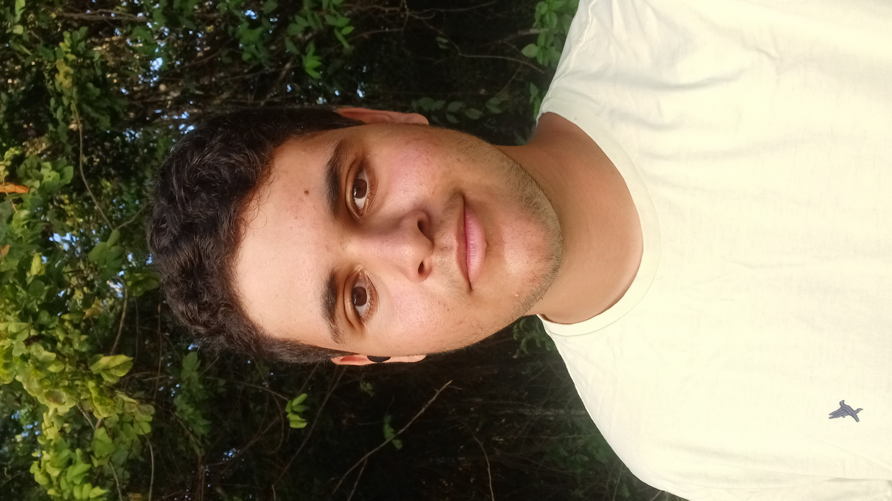

  <h1>Welcome to my profile!</h1>

## Summary:
- 👀 I’m interested in ...
- 🌱 I’m currently learning ...
- 💞️ I’m looking to collaborate on ...
- 📫 How to reach me ...
- 😄 Pronouns: ...
- ⚡ Fun fact: ...

<!-- THEMES FOR README STATS:
Common:
- username=lucarl07
- theme=ambient_gradient
- bg_color=45,fcba03,fc4903 (order of the colors may invert)

Original app by anuraghazra on: 
- https://github.com/anuraghazra/github-readme-stats
-->
## My GitHub statistics:

## What I'm using/learning:

  
  
  
  
  

## About Me:
<section id="bio">
  

  

    <h3>A Brief Biography</h3>
    

      Hello stranger! My name is Luiz (pronounced "loo-is") and although I'm a programming student now, I'll soon be a full-stack developer. I've been learning Web Development since 2023, <!-- (hope that will spare some updates) --> starting Node.js and React this year. <!-- (but that won't) --> Moreover, i did a Linguaskill test back on 2022, in which i got a score of +180 points and was ranked at a C1 (Proficiency) CEFR level. Though i must say, nowadays I don't practice my written, formal English enough, so please pardon any mistakes.
    

    

      I was born on January 24th 2007 in Maceió, Brazil. Over the years, a lot of time spent on the internet and quite a bit of curiosity ended on me trying to learn to code at the age of 9 (yes, nine), but that didn't go very well, since i didn't knew a lot of English (or mathematical logic at all) back then. After briefly learning the basics of JavaScript during late 2022, my proper journey in the world of programming would truly start with my ongoing technical course on SENAI-AL with HTML, CSS and JavaScript. The good old ones, y'know?
    

  

</section>

### Want to contact me?

<!-- Use the following links to place badges:
https://hendrasob.github.io/badges/#list-of-badges-for-your-profile
https://home.aveek.io/GitHub-Profile-Badges/
-->

